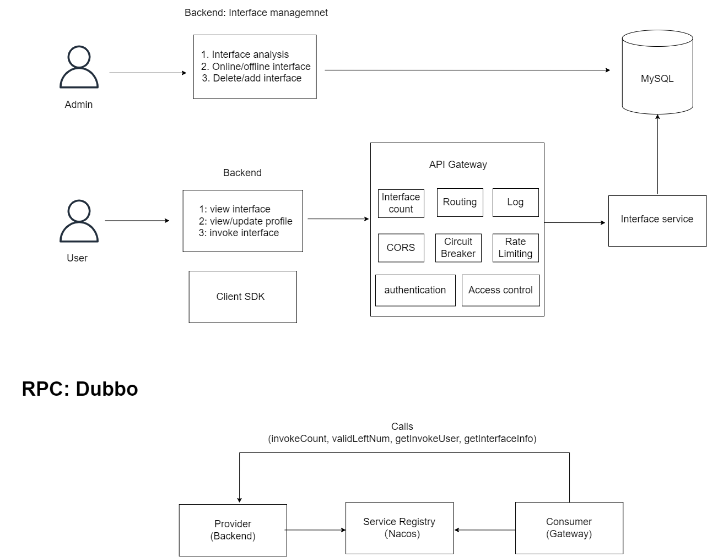
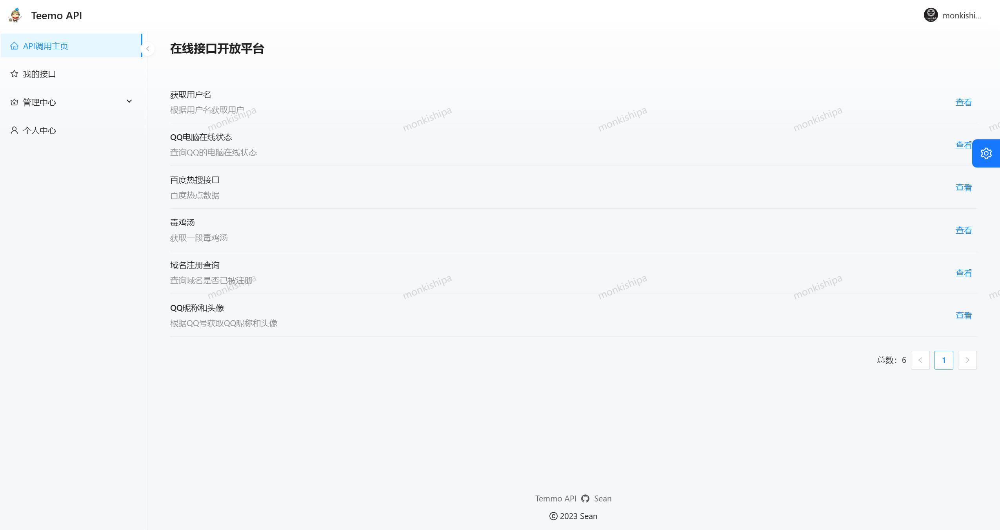
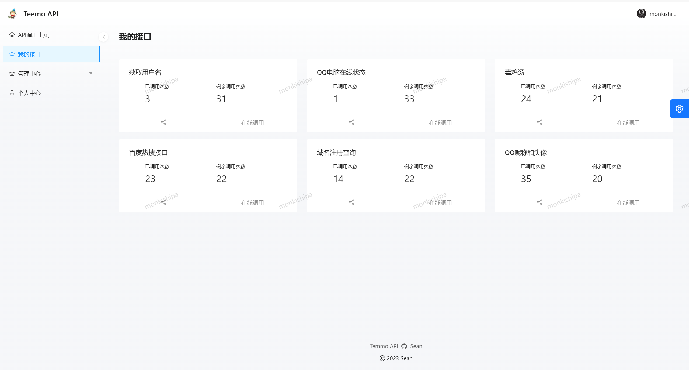
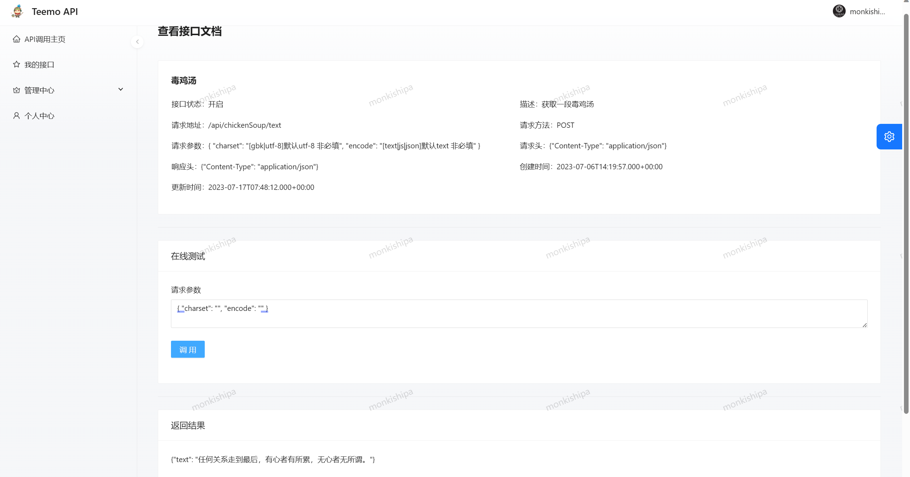
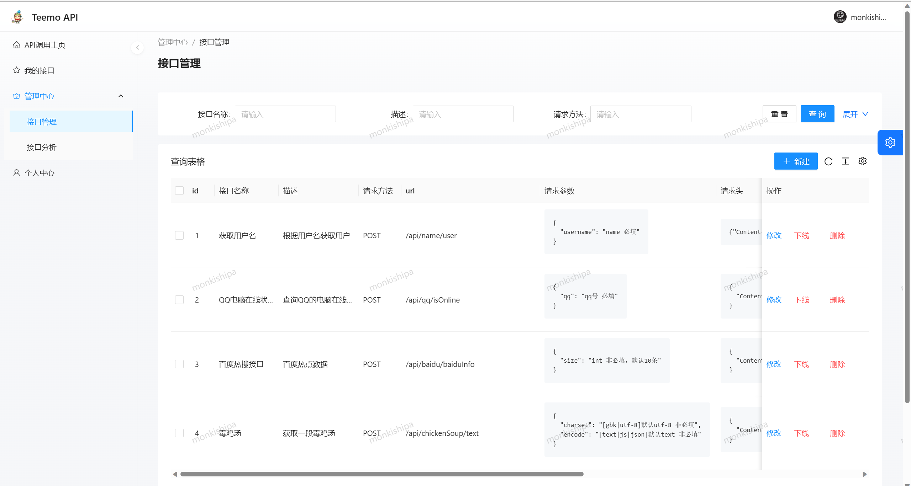
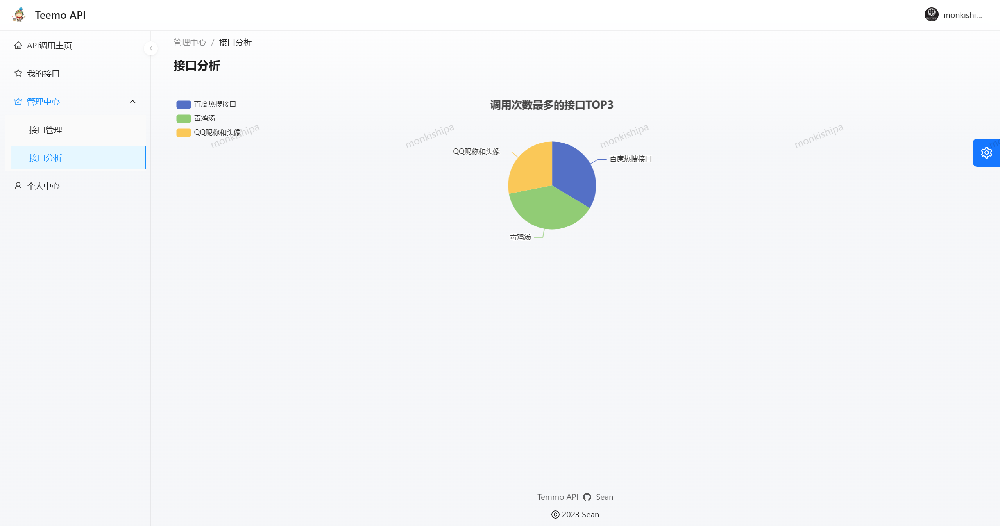
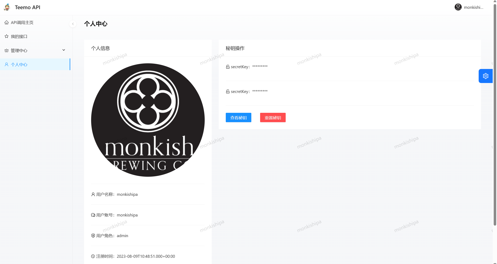

# API platform ☘️

> A full variety of API open call platform , provides a number of interfaces to call
>
> Based on **Spring Boot + Dubbo + Spring Cloud Alibaba + MyBatis Plus + Redis + React** API interface  call platform. Administrators can access and publish interfaces, visualize the call of each interface; users can log in to register, open interface call privileges, view interfaces and online debugging, and easily call the interface through the client SDK
>
> A full-stack project which has been deployed!
>
> Address：[API calls platform](http://49.232.228.46/)


## Background  📖

There are many API platforms, but not unified enough, this platform helps enterprises and individuals to unify open interfaces, reduce communication costs and efficiently empower business.

**Easy API platform strives to provide users with a simple, practical interface call experience, and the use of API signature verification to protect the security of interface calls**


## System Architecture  ⭐





## Tech stack 🔥

### Frontend:

- React 18
- Ant Design Pro
- Ant Design & Procomponents 
- Umi 4 Front-End Framework
- OpenAPI Front-End Code Generation


### Backend:

- Java Spring Boot
- MySQL
- MyBatis-Plus & MyBatis X 
- API Signature Authentication (Http Calls)
- Spring Boot Starter (SDK Development)
- Dubbo Distributed (RPC, Nacos)
- Swagger + Knife4j Interface Documentation Generation
- Spring Cloud Gateway Microservices Gateway
- Hutool, Apache Common Utils, Gson


## Project modules 📚

- yuapi-frontend ：Project front-end, front-end project startup specifically see readme.md document
- yuapi-common ：Public encapsulated classes (e.g., public entities, public constants, public methods)
- api-backend-master ：Interface management system, mainly including user and interface related functions
- yuapi-gateway ：Gateway services, involving authentication, log processing, traffic coloring, interface statistics
- yuapi-interface：Interface services, which provide mock-up interfaces that can be called
- yuapi-client-sdk：SDK for developers


## Functional module  🎊

> 🌟 Core function   
>
> 🚀 To do

- User、Admin
  - Login/registration/logout
  - Profile
  - Admin：Interface management
  - Admin：Interface analysis
- 接口
  - View interface information
  - 🌟 Signature Verification Interface Calling Privileges
  - 🌟 SDK Calling Interface
  - 🌟 Valid calling count
  - Users upload their own interfaces（🚀）
  


## Project display 🎰


- Home page




- Interface count

  

  


- Interface invoke




- Interface management




- Interface analysis




- Profile




---


## Quick start 🏃‍♂️

### Backend

1. Configuration of your own database
2. Start Nacos、Mysql、Redis、RabbitMQ
3. Install the public service easyapi-common and the downloaded SDK into your local maven repository
4. Starting services in sequence below:

​	api-backend-master

​	yuapi-gateway

​	yuapi-interface


### Frontend

Environment：Node.js >= 16

Dependency：

```
npm i @ant-design/pro-cli -g
npm i
```

Start：

```
npm run start:dev
```


## Contribution 👨‍👨‍👦‍👦

Looking forward to more contributions：

- I will respond positively to bugs and suggestions in the Issues section.


